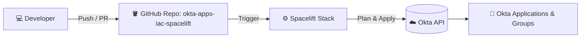

# 🚀 Automated Okta Infrastructure-as-Code with Spacelift & OpenTofu

This repository automates **Okta application and configuration management** using **Spacelift** and **OpenTofu (Terraform-compatible)**.  
It provides a secure, version-controlled, and auditable workflow for managing Okta resources — with Spacelift handling automation, state, and policy enforcement.

---

## 🧩 Overview

**Goal:**  
Enable Infrastructure-as-Code (IaC) for managing Okta apps, users, and integrations using Terraform modules deployed automatically through Spacelift.

**Key Benefits:**
- ✅ Automated CI/CD for Okta IaC
- 🔒 Secure secret management via Spacelift
- 🔁 Consistent provisioning and drift detection
- 📜 Full auditability through GitHub pull requests and Spacelift logs

---

## 🏗️ Architecture



**Flow Explanation:**
1. Developer commits or opens a pull request in GitHub.
2. Spacelift automatically triggers a **plan** run.
3. Upon approval, Spacelift executes **apply**.
4. Okta configuration updates are applied via API calls through OpenTofu.

---

## 🗂️ Repository Structure

```
okta-apps-iac-spacelift/
├── infra/
│   ├── .terraform/
│   ├── modules/
│   ├── main.tf
│   ├── providers.tf
│   ├── salesforcetestapp2.tf
│   ├── terraform.lock.hcl
│   ├── terraform.tfvars.example
│   └── versions.tf
├── modules/
│   ├── okta-app-native-oidc/
│   ├── okta-app-spa-oidc/
│   ├── okta-app-web-oidc/
│   ├── okta-app-web-saml/
│   ├── okta-app-web-saml-preconfig/
│   └── okta-groups/
└── README.md
```

📸 **Repo Structure Screenshots**

### `infra` Folder


### `modules` Folder


---

## ⚙️ Spacelift Stack Configuration

Spacelift integrates this repository (`adminiamconnect/okta-apps-iac-spacelift`) to automate Okta provisioning.

---

### 🧾 Environment Variables


| Variable | Description |
|-----------|--------------|
| `SPACELIFT_API_TOKEN` | Auth token for Spacelift automation. |
| `TF_CLI_ARGS_apply` / `TF_CLI_ARGS_plan` | Control OpenTofu parallelism (`-parallelism=2`). |
| `TF_VAR_okta_api_token` | Okta API token (stored securely). |
| `TF_VAR_okta_base_url` | Okta domain (e.g. `okta.com`). |
| `TF_VAR_okta_org_name` | Okta org identifier (e.g. `integrator-4434817`). |

🔒 **Secret Masking** is enabled to ensure sensitive values are never exposed in logs.

---

### 🧱 Stack Details


| Field | Description |
|--------|-------------|
| **Name** | `okta` |
| **Space** | `root` |
| **Labels** | Optional tags to auto-attach contexts, enable policies, or integrate with Infracost. |
| **Description** | Short summary of the stack’s purpose. |

---

### 🛠️ Source Code Configuration


| Setting | Description |
|----------|-------------|
| **Repository** | `adminiamconnect/okta-apps-iac-spacelift` |
| **Branch** | `main` |
| **Project Root** | `infra/` |
| **Checkout Paths** | Optional for modular project filtering. |

🧩 This ensures Spacelift monitors the `infra/` directory for IaC changes and triggers plan runs automatically.

---

### 🧰 Vendor Configuration


| Parameter | Value |
|------------|--------|
| **Vendor** | Terraform / OpenTofu |
| **Version** | `1.10.7` |
| **Smart Sanitization** | ✅ Enabled |
| **External State Access** | ❌ Disabled (recommended) |

> OpenTofu ensures full Terraform compatibility while remaining open-source and auditable.

---

### ⚙️ Behavior Configuration


| Setting | Description |
|----------|-------------|
| **Administrative Access** | ⚠️ Deprecated (migrating to Role-Based Access by June 2026). |
| **Enable Secret Masking** | ✅ Redacts secrets automatically in logs. |
| **Protect from Deletion** | ✅ Prevents accidental removal of production stacks. |
| **Transfer Sensitive Outputs** | ✅ Allows secure variable propagation between stacks. |
| **Autodeploy / Autoretry** | 🔄 Optional for full automation pipelines. |

---

## 🔁 CI/CD Workflow

1. **Developer pushes code** → GitHub triggers Spacelift.
2. **Spacelift Plan** → Generates preview of changes.
3. **Approval Gate** → Manual or automatic depending on policy.
4. **Spacelift Apply** → Executes Terraform / OpenTofu apply.
5. **State stored securely** → Managed by Spacelift backend.
6. **Notifications** → Sent to Slack or email (if integrated).

---

## 🔒 Security Best Practices

| Recommendation | Description |
|----------------|-------------|
| **Use Spacelift Contexts** | Centralize shared variables and secrets. |
| **Enable Secret Masking** | Protect tokens and API keys in logs. |
| **Role-Based Access** | Replace administrative access before June 2026. |
| **Limit External State** | Disable public read access unless required. |
| **Rotate Tokens** | Rotate `TF_VAR_okta_api_token` periodically. |

---

## 🧠 Best Practices for Okta IaC

| Area | Recommendation |
|------|----------------|
| **Structure** | Keep Terraform modules modular and reusable. |
| **Naming** | Prefix stacks by provider (`okta-`, `google-`, etc). |
| **Versioning** | Pin all provider and module versions. |
| **Parallelism** | Use conservative concurrency (`-parallelism=2`). |
| **Testing** | Always review and validate `plan` before `apply`. |

---

## 💡 Example Developer Workflow

```bash
# Developer updates or adds new Okta app module
git add .
git commit -m "Add new Okta SAML app configuration"
git push origin main

# Spacelift automatically triggers
spacelift plan
# → generates plan and awaits approval

# Once approved
spacelift apply
# → applies configuration to Okta via API
```

---

## 🏁 Conclusion

🎉 This setup provides a **scalable, secure, and automated** Okta Infrastructure-as-Code pipeline powered by **Spacelift + OpenTofu**.  
All configuration changes are version-controlled, peer-reviewed, and applied consistently — ensuring a robust, auditable identity management process.

---

### 📚 References
- [Spacelift Documentation](https://docs.spacelift.io)
- [OpenTofu](https://opentofu.org)
- [Okta Terraform Provider](https://registry.terraform.io/providers/okta/okta/latest/docs)
